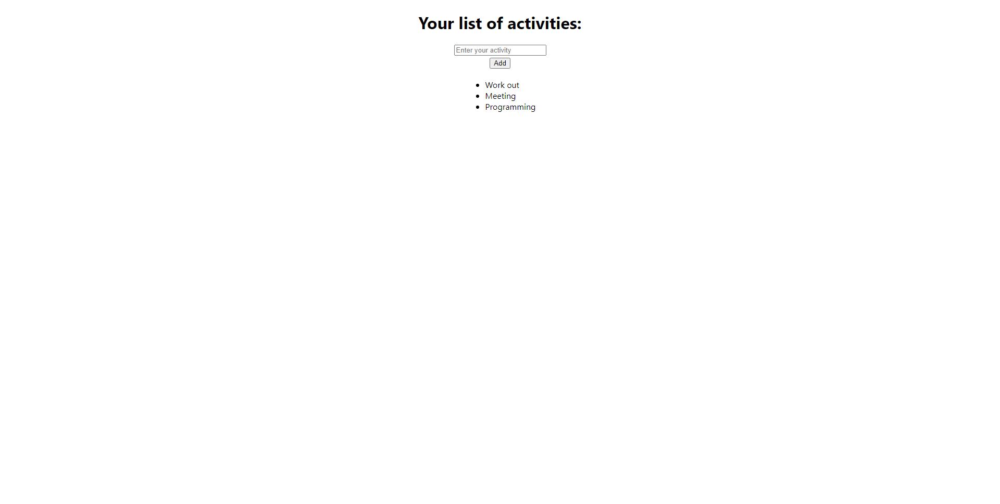

# ToDoList with Redux Toolkit

> See demo live : [click here](https://react-tsc-redux-toolkit-todolist.netlify.app 'click to open link')

## Description

The purpose of this project is to practice Redux Toolkit by storing and displaying data which user add by input.
Minimalist styling.
 

## Features

- Add data
- Display added data
- Remove pointed data
- Redux Toolkit used for storing data.

## Built using

- React
- Typescript
- Redux Toolkit
